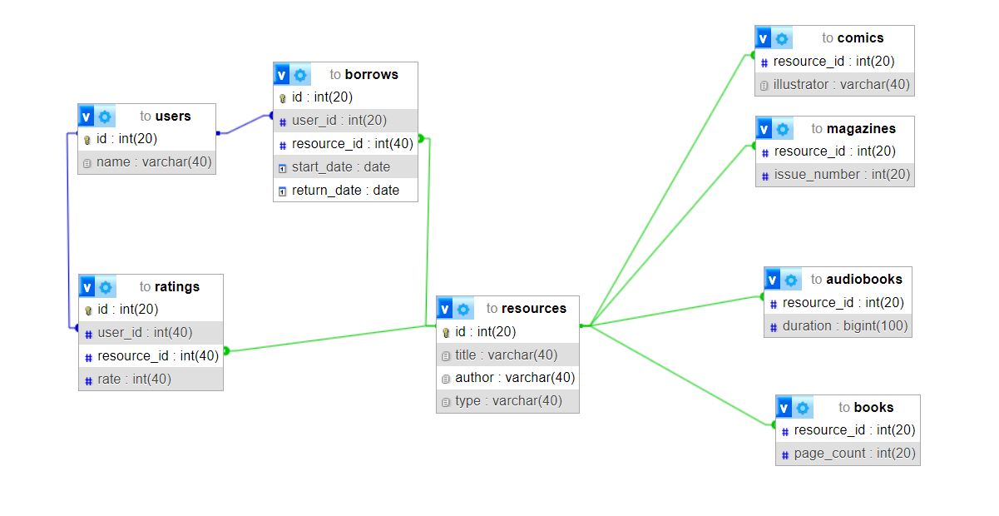

## Library management system

### Description
The Library Project is a library resource management system in which users can browse, borrow, return and evaluate various types of resources, such as books, comics, audiobooks and magazines. Below you will find information about the configuration, functions and structure of the project.
### Table of Contents

- [Project Name](#library-management-system)
    - [Description](#description)
    - [Table of Contents](#table-of-contents)
    - [Requirements](#requirements)
    - [Configuration](#configuration)
    - [Starting](#starting)
    - [Project Structure](#project-structure)
    - [Function](#functions)
    - [Diagram ERD](#DiagramERD)
    - [Creators](#creators)

### Requirements

1. **Java**: The project is written in Java, so it is required to install the Java Runtime Environment (JRE) on your system.
2. **Database**: The project uses a MySQL database. Make sure you have MySQL installed and created a database called "this". In the file `Database.Database` you will find data for connecting to the database.

### Configuration

1. **Development Environment**: Open the project in your favorite development environment (e.g. IntelliJ IDEA).
2. **Database**: Make sure you have access to the MySQL database and update the connection settings in the `Database.Database` file.

### Starting

1. Start the main class: `Console`. This will launch the library application.
2. You can use a text console or implement a user interface (GUI) to test system functions.

### Project structure
- **Database**: Contains the `Database` class that handles database connection.
- **Resources**: Responsible for representing different types of library resources such as books, comics, audiobooks, and magazines.
- **Repository**: Contains repository interfaces and implementations to support CRUD operations on resources and users.
- **Decorator**: Provides an implementation of the decorator pattern for evaluating library resources.
- **Factory**: Implements the factory pattern for creating different types of resources.

### Functions

Project Library offers the following features:

- Adding and deleting resources / users.
- Browse available library resources.
- Borrowing and returning resources.
- User rating of resources.
- View information about borrowed resources and their status.
### Diagram ERD

## Creators
The project is developed by Dominika Hojniak. Contact: dominikahojniak@gmail.com

